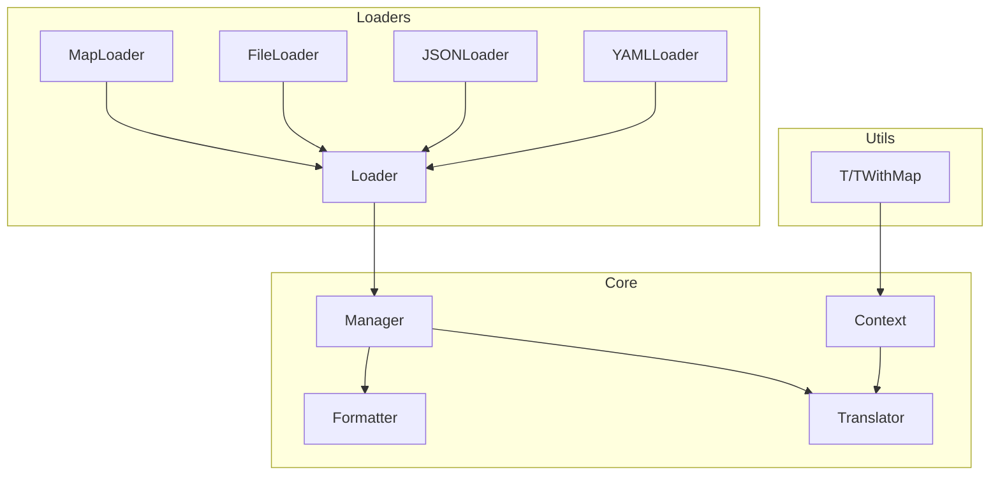

# go-i18n

功能强大的 Go 国际化（i18n）库，支持多种消息格式、语言回退和灵活的消息加载方式

## 特性

- **多种消息格式**：`fmt.Sprintf` 风格、`{key}`、`{{key}}`、`{{.key}}`
- **语言回退**：自动回退到默认语言
- **灵活加载**：Map、JSON、YAML、文件等多种来源
- **线程安全**：使用互斥锁保证并发安全
- **可扩展**：支持自定义格式化器和消息加载器

## 框架图



## 核心组件

| 组件 | 文件 | 说明 |
|------|------|------|
| Manager | manager.go | 国际化管理器，负责消息加载、语言解析和翻译 |
| Formatter | format.go | 消息格式化器，支持多种占位符格式 |
| Translator | context.go | 翻译器接口，解耦 Context 与 Manager |
| Context | context.go | 国际化上下文，支持链式翻译操作 |
| Loader | loader.go | 消息加载器接口 |
| MapLoader | loader_map.go | 内存 Map 加载器 |
| FileLoader | loader_file.go | JSON 文件加载器 |
| JSONLoader | loader_json.go | JSON 字符串加载器 |
| YAMLLoader | loader_yaml.go | YAML 文件/字符串加载器 |

## 安装

```bash
go get github.com/kamalyes/go-i18n
```

## 基本用法

### 1. MapLoader 示例

```go
loader := i18n.NewMapLoader(map[string]map[string]string{
    "en": {"hello": "Hello", "greeting": "Hello {name}"},
    "zh": {"hello": "你好", "greeting": "你好 {name}"},
})

config := &gci18n.I18N{
    Enable: true, DefaultLanguage: "en",
    SupportedLanguages: []string{"en", "zh"},
    MessageLoader: loader, EnableFallback: true,
}

manager, _ := i18n.NewManager(config)

manager.GetMessage("en", "hello")                                    // "Hello"
manager.GetMessage("zh", "hello")                                    // "你好"
manager.GetMessage("en", "greeting", "John")                        // "Hello John"
manager.GetMessageWithMap("en", "greeting", map[string]any{"name": "John"}) // "Hello John"
```

### 2. FileLoader 示例

```go
// 假设存在 i18n 目录，包含 en.json 和 zh.json 文件
loader := i18n.NewFileLoader("i18n")

config := &gci18n.I18N{
    Enable: true, DefaultLanguage: "en",
    SupportedLanguages: []string{"en", "zh"},
    MessageLoader: loader, EnableFallback: true,
}

manager, _ := i18n.NewManager(config)
```

### 3. JSONLoader 示例

```go
jsonContent := `{
    "en": {"hello": "Hello", "greeting": "Hello {name}"},
    "zh": {"hello": "你好", "greeting": "你好 {name}"}
}`

loader := i18n.NewJSONLoader(jsonContent)

config := &gci18n.I18N{
    Enable: true, DefaultLanguage: "en",
    SupportedLanguages: []string{"en", "zh"},
    MessageLoader: loader, EnableFallback: true,
}

manager, _ := i18n.NewManager(config)
```

### 4. YAMLLoader 示例

```go
yamlContent := `
en:
  hello: "Hello"
  greeting: "Hello {name}"
zh:
  hello: "你好"
  greeting: "你好 {name}"
`

loader := i18n.NewYAMLLoader(yamlContent)

config := &gci18n.I18N{
    Enable: true, DefaultLanguage: "en",
    SupportedLanguages: []string{"en", "zh"},
    MessageLoader: loader, EnableFallback: true,
}

manager, _ := i18n.NewManager(config)
```

### 5. 不同消息格式示例

```go
// fmt.Sprintf 风格
manager.GetMessage("en", "greeting", "John") // "Hello John"

// {key} 风格
manager.GetMessageWithMap("en", "greeting", map[string]any{"name": "John"}) // "Hello John"

// {{key}} 风格（需要在消息中使用 {{name}} 格式）
// {{.key}} 风格（需要在消息中使用 {{.name}} 格式）
```

### 6. 语言回退示例

```go
// 当请求的语言不存在时，会回退到默认语言
manager.GetMessage("fr", "hello") // 回退到 "Hello"（默认语言 en）

// 当请求的消息键不存在时，会返回原始键
manager.GetMessage("en", "non_existent_key") // "non_existent_key"
```

### 7. 链式翻译操作

```go
// 创建上下文
ctx := manager.NewContext("en")

// 链式调用
result := ctx.T("greeting").WithMap(map[string]any{"name": "John"}).String() // "Hello John"

// 或者使用 TWithMap 直接传参
result := ctx.TWithMap("greeting", map[string]any{"name": "John"}).String() // "Hello John"
```

### 8. 错误处理

```go
manager, err := i18n.NewManager(config)
if err != nil {
    log.Fatalf("Failed to create manager: %v", err)
}

// 检查消息是否存在
if !manager.HasMessage("en", "hello") {
    log.Println("Message 'hello' not found in English")
}
```

## 测试

```bash
# 测试所有组件并生成覆盖率报告
go test -cover ./... -v
```

## 文档

| 文档 | 说明 |
|------|------|
| [docs/API.md](docs/API.md) | API 参考 |
| [docs/Loaders.md](docs/Loaders.md) | 消息加载器 |
